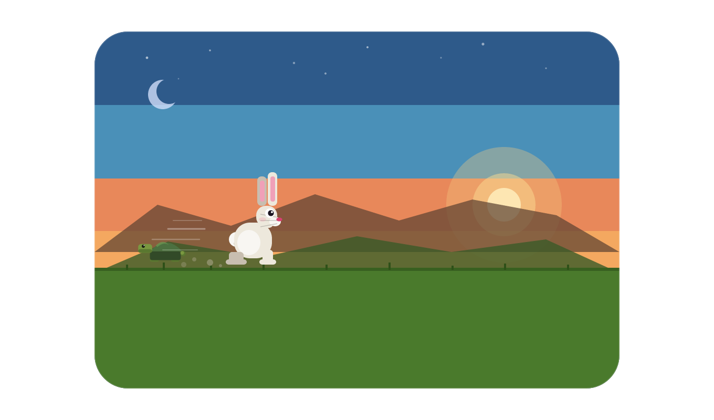

# Rabbit Run!



An endless browser game where a rabbit dodges tortoises across a world that travels through a full day:from dawn to deep night.

Built with vanilla HTML5 Canvas. No libraries, no build tools, no external assets.

**Play now:** https://viveknaskar.github.io/rabbit-game/

---

## How to play

| Key / Input | Action |
|-------------|--------|
| `SPACE` or **Tap** | Jump over a tortoise |
| `P` | Pause / unpause |
| `R` | Restart after game over / Resume when paused |
| `M` | Mute / unmute music |
| Volume slider | Adjust music volume |

Survive as long as you can. The game gets faster as your score climbs, and the sky shifts from sunrise to midnight along the way.

---

## Features

- **Difficulty modes**: choose Easy, Normal, or Hard before each run
- **Day/Night cycle**: sky, clouds, sun, and moon transition smoothly as your score climbs
- **Procedural music**: upbeat day theme switches to an atmospheric night theme, all generated with the Web Audio API
- **Score milestones**: visual ring burst and chime at key score thresholds
- **Top 5 leaderboard**: best scores saved locally and shown on the game-over screen
- **Pause mechanic**: pause mid-run with `P`; game also auto-pauses when you switch tabs
- **Mobile support**: tap to jump, responsive canvas, touch-friendly layout
- **Volume control**: slider to adjust music volume independently of mute
- **Frame-rate independent physics**: consistent feel across 60fps and non-60fps displays

---

## Run locally

No setup needed, just open the file:

```bash
# Windows
start index.html

# macOS / Linux
open index.html
```

---

## Tests

Unit tests cover colour interpolation, collision detection, scoring, leaderboard logic, difficulty profiles, and physics. No dependencies required — runs with Node.js.

```bash
node tests/game.test.js
```
